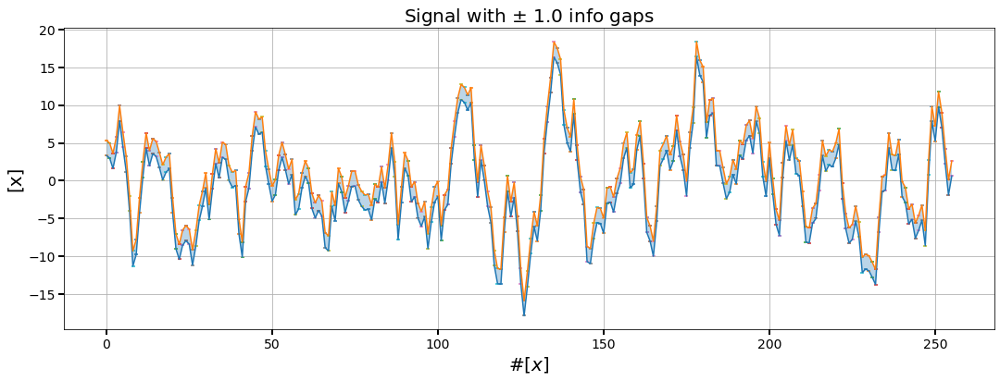
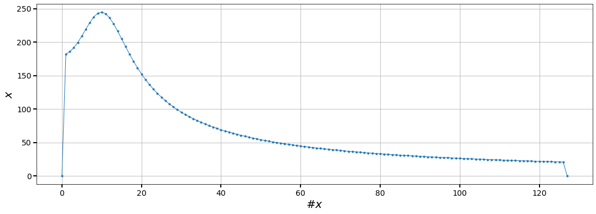
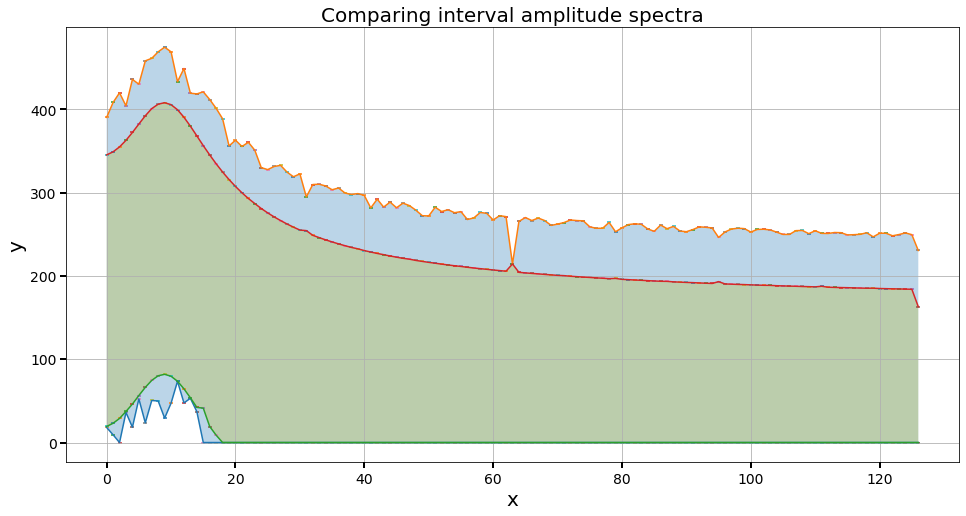
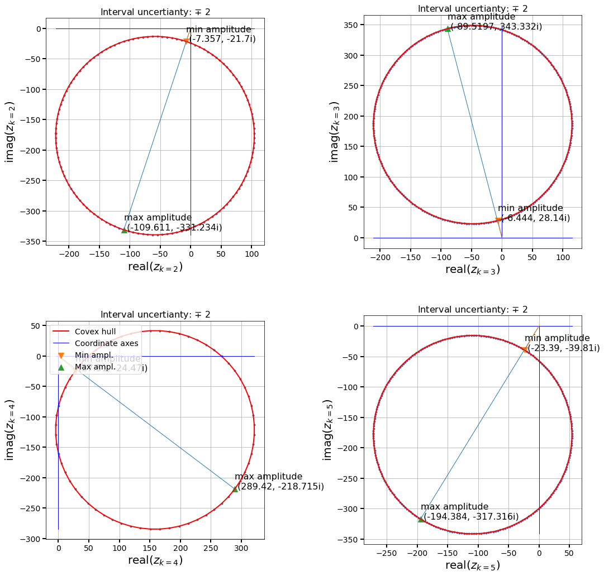

# Fourier-transform
Fourier transform code for gappy (intervalized) signals.

This code implements the idea developed in the paper:

*Forward interval propagation through the Fourier discrete transform*. 
M De Angelis, M Behrendt, L Comerford, Y Zhang, M Beer; 
arXiv preprint [arXiv:2012.09778].

[https://arxiv.org/abs/2012.09778]: arXiv:2012.09778

```latex
@misc{deangelis2020forward,
      title={Forward interval propagation through the Fourier discrete transform}, 
      author={Marco De Angelis and Marco Behrendt and Liam Comerford and Yuanjin Zhang and Michael Beer},
      year={2020},
      eprint={2012.09778},
      archivePrefix={arXiv},
      primaryClass={eess.SP}
}
```

# How to use the code library

## Import the *gappy* Fourier transform package


```python
from lib.fourier import transform as gappyFT
```

### Generate a signal from a stationary power spectrum

This generates a *precise* signal.


```python
signal,n = gappyFT.generate_signal(N=8) # Shinozuka
# NN = 2**N #=64
```


```python
gappyFT.plot_signal(signal,lw=1,title='Signal from stationary power spectrum',color='rebeccapurple')
```


## Imprecise signal
Let us add $\pm$1 interval uncertainty to the time signal. 


```python
intervalsignal = gappyFT.intervalize(signal, plusminus=1.0) # output an interval vector
```


```python
print(intervalsignal)
```

    【3.36318, 5.36318】
    【2.99323, 4.99323】
    【1.63038, 3.63038】
    【3.75561, 5.75561】
    【7.92647, 9.92647】
    ...
    【9.78841, 11.7884】
    【7.05103, 9.05103】
    【2.27956, 4.27956】
    【-1.87866, 0.121342】


```python
intervalsignal.plot\
(xlabel=r'#$[x]$',ylabel=r'[x]',title=r'Signal with $\pm$ 1.0 info gaps')
```





```python
FA = gappyFT.compute_amplitude(signal)
```


```python
gappyFT.plot_signal(FA)
```





# Compute the interval amplitude spectrum

`compute_spectrum_bounds` outputs two arrays:

* array 1 : amplitude bounds with enclosing box method

* array 2 : amplitude bounds with selective method


```python
AMPLITUDE_I, AMPLITUDE_H = gappyFT.compute_amplitude_bounds(intervalsignal)
```


```python
from matplotlib import pyplot
fig, ax = pyplot.subplots(figsize=(16,8))
AMPLITUDE_I.plot(ax=ax)
AMPLITUDE_H.plot(ax=ax)
ax.set_title('Comparing interval amplitude spectra', fontsize=20)
ax.grid()
```





```python
gappyFT.plot_verify_ch(intervalsignal,freq=[2,3,4,5],figsize=(15,15),aspect='equal')
```




